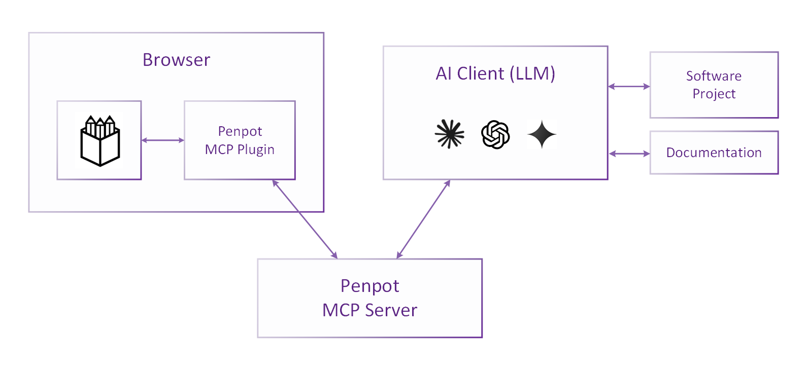

# The Penpot MCP Server

This project enables LLMs to interact directly with Penpot design projects 
using the Model Context Protocol (MCP), building on Penpot's Plugin API
to facilitate design data retrieval, modification, and creation.


## Architecture

The Penpot MCP server exposes tools to AI clients (LLMs), which support the retrieval
of design data as well as the modification and creation of design elements.
The MCP server communicates with Penpot via a dedicated Penpot MCP plugin,
which connects to the MCP server via WebSocket.



This repository is a monorepo containing four main components:

1. **Common Types** (`common/`): 
   - Shared TypeScript definitions for request/response protocol
   - Ensures type safety across server and plugin components

2. **Penpot MCP Server** (`mcp-server/`): 
   - Provides MCP tools to LLMs for Penpot interaction
   - Runs a WebSocket server accepting connections from the Penpot MCP plugin
   - Implements request/response correlation with unique task IDs
   - Handles task timeouts and proper error reporting

3. **Penpot MCP Plugin** (`penpot-plugin/`):
   - Connects to the MCP server via WebSocket
   - Executes tasks in Penpot using the Plugin API  
   - Sends structured responses back to the server#

4. **Helper Scripts** (`python-scripts/`):
   - Python scripts that prepare data for the MCP server (development use)

The core components are written in TypeScript, rendering interactions with the
Penpot Plugin API both natural and type-safe.


## Usage

To use the Penpot MCP server, you must
 * run the MCP server and connect your AI client to it,
 * run the Penpot MCP plugin in Penpot and connect it to the MCP server.

### Build & Launch the MCP Server and the Plugin Server

If it's your first execution, install the required dependencies:
```shell
npm install
```

Then build all components and start them:
```shell
npm run bootstrap
```

This bootstrap command will: 
  * install dependencies for all components (`npm run install:all`)
  * build all components (`npm run build:all`)
  * start all components (`npm run start:all`)


### Load the Plugin in Penpot and Establish the Connection

1. Open Penpot in your browser
2. Navigate to a design file
3. Open the Plugins menu
4. Load the plugin using the development URL (`http://localhost:4400/manifest.json` by default)
5. Open the plugin UI
6. In the plugin UI, click "Connect to MCP server".
   The connection status should change from "Not connected" to "Connected to MCP server".  
   (Check the browser's developer console for WebSocket connection logs.
   Check the MCP server terminal for WebSocket connection messages.)

### Connecting an MCP Client

By default, the server runs on port 4401 and provides:

- **Modern Streamable HTTP endpoint**: `http://localhost:4401/mcp`
- **Legacy SSE endpoint**: `http://localhost:4401/sse`

These endpoints can be used directly by MCP clients that support them.
Simply configure the client to the MCP server by providing the respective URL.

When using a client that only supports stdio transport,
a proxy like `mcp-remote` is required.

#### Using a Proxy for stdio Transport

The `mcp-remote` package can proxy stdio transport to HTTP/SSE, 
allowing clients that support only stdio to connect to the MCP server indirectly.

1. Install `mcp-remote` globally if you haven't already:

        npm install -g mcp-remote

2. Use `mcp-remote` to provide the launch command for your MCP client:

        npx -y mcp-remote http://localhost:4401/sse --allow-http

#### Example: Claude Desktop

For Claude Desktop integration, you will need to use a proxy like `mcp-remote` since it only supports stdio transport.
Install `mcp-remote` as described above.

To add the server to Claude Desktop's configuration, locate the configuration file:

- **Windows**: `%APPDATA%/Claude/claude_desktop_config.json`
- **macOS**: `~/Library/Application Support/Claude/claude_desktop_config.json`

Add a `penpot` entry under `mcpServers` with the following content: 

```json
{
    "mcpServers": {
        "penpot": {
            "command": "npx",
            "args": ["-y", "mcp-remote", "http://localhost:4401/sse", "--allow-http"]
        }
    }
}
```

After updating the configuration file, restart Claude Desktop completely for the changes to take effect.
Be sure to fully quit the app! On Windows, right-click the tray icon and select "Quit".

After the restart, you should see the MCP server listed when clicking on the "Search and tools" icon at the bottom
of the prompt input area.
